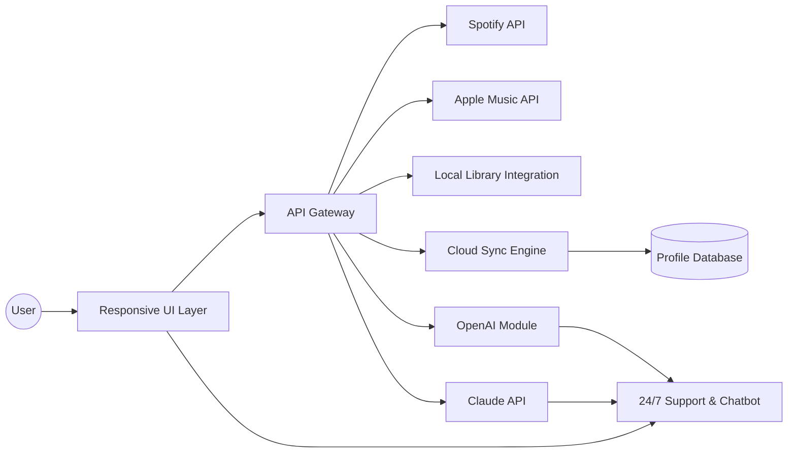

# Harmonix: Next-Gen Music Management & Streaming Companion 🎶

> **Built for 2026, crafted for tomorrow’s music lovers.**  

---

## 🚀 Introduction

**Harmonix** is not your average music streaming sidekick. 🌌 Designed to orchestrate rich, interactive soundscapes with an intuitive interface, Harmonix serves as a multidisciplinary dashboard to manage, curate, and seamlessly stream music playlists from multiple sources — going beyond the boundaries of standard applications. Whether you crave effortless playlist management, or want to infuse your music routine with the powers of OpenAI and Claude AI integrations, Harmonix delivers an experience as harmonious as your favorite song’s melody.

> Harmonix empowers audiophiles and casual listeners alike, joining your favorite streams into a single, powerful narrative.

---

## 📜 Table of Contents

- [Download](#download)
- [Features Overview](#features-overview)
- [Mermaid Architecture Diagram](#mermaid-architecture-diagram)
- [Example Profile Configuration](#example-profile-configuration)
- [Example Console Invocation](#example-console-invocation)
- [Emoji OS Compatibility Table](#emoji-os-compatibility-table)
- [OpenAI & Claude API Integration](#openai--claude-api-integration)
- [SEO-Optimized Keywords](#seo-optimized-keywords)
- [License](#license)
- [Disclaimer](#disclaimer)
- [Download Again](#download-again)

---

## 🎯 Features Overview

Harmonix has been sculpted with forward-thinking music enthusiasts in mind. Here’s a taste of its unique flavor:

- **Universal Audio Harmony**: Orchestrate playlists across platforms like Spotify, Apple Music, and local libraries.
- **Responsive, Adaptive UI**: Enjoy Harmonix from your desktop monitor or mobile device—dynamic resizing ensures pixel-perfect clarity.
- **Multilingual Experience**: Switch between languages (EN, ES, FR, DE, JP, and more) with a single click.
- **24/7 Symphonic Support**: Our dedicated support team and real-time chatbot assistants (powered by OpenAI & Claude) keep you tuned and satisfied.
- **AI-Powered Playlist Curator**: Leveraging next-gen AI to recommend new listens and craft playlists from your listening habits.
- **Customizable Profiles**: Craft your own listening persona—adjust genres, moods, and connection settings.
- **CLI Maestro Mode**: Full-featured console invocation for power users—automate playlist creation or batch download tracks.
- **Crossover Cloud Sync**: Access your music, preferences, and statistics anywhere, anytime.
- **Zero-Error Caching**: Smart buffering for blazing-fast start/stop, even in low network zones.

---

## ♻️ SEO-Optimized Keywords

Discover and enjoy:

- Next-generation music streaming toolkit
- Multi-platform playlist manager 2026
- AI music recommendation engine
- Cross-platform music syncing
- Adaptive audio dashboard
- Responsive streaming interface
- Universal playlist curator
- Multilingual music experience
- AI Chatbot support for music management

---

## 🧭 Mermaid Architecture Diagram

Dive beneath the surface! Here’s how Harmonix orchestrates your audio symphony:

---

## 📝 Example Profile Configuration

Here’s a sample config file for your Harmonix journey:

    {
      "username": "melophile2026",
      "preferred_language": "en",
      "connected_services": ["spotify", "apple_music"],
      "theme": "noir",
      "ai_curator_enabled": true,
      "playlist_preferences": {
        "genre_focus": ["alt-rock", "chillhop", "classical"],
        "mood": "energetic"
      }
    }

---

## 🖥️ Example Console Invocation

Stay in rhythm—even in the terminal. Create a curated playlist with one command:

    harmonix-cli --create-playlist --source "Spotify" --genres "lofi, synthwave" --mood "focus" --export "MyFocusMix2026.m3u"

---

## 🍏 Emoji OS Compatibility Table

Platform | Compatibility | Notes
--- | --- | ---
🐧 Linux | 👍 Full Support | CLI and GUI
🪟 Windows | 👍 Full Support | Native App + CLI
🍎 macOS | 👍 Full Support | M1+ Support
📱 Android | 🟢 In Development | Mobile Interface Beta
📱 iOS | 🟢 In Development | Awaiting TestFlight

---

## 🤖 OpenAI & Claude API Integration

Harmonix offers unrivaled intelligence by connecting with both **OpenAI** and **Claude**. These integrations empower chatbot support, lightning-quick recommendations, and dynamic playlist generation. Imagine:  
- Whisper a mood or event, and Harmonix's AI co-pilots assemble the perfect auditory landscape.  
- Engage with always-available chatbot guides for tech tips and music discovery.
- The best of **2026 streaming AI**—at your fingertips, multilingual and always learning from your tastes.

---

## ⭐ Key Benefits

- **Seamless Multiplatform Music Control**  
  No more switching apps. Harmonix is your music command center.

- **Real-Time AI Personalization**  
  AI-powered recommendations & playlist creation—making each session personal and fresh.

- **Accessibility for All**  
  Multilingual, adaptive, with enhanced accessibility for a wide audience in 2026.

- **Always-On Support**  
  Whether it’s 2 pm or 2 am, AI-powered helpers and human support are just a click away.

- **Secure by Design**  
  Your personal preferences, data, and playlists are safeguarded with industry standard protocols.

---

## 📖 License

Harmonix is distributed under the MIT License.  
Find full legal text here: [MIT LICENSE](LICENSE)

---

## ⚠️ Disclaimer

Harmonix is an independent software project developed for educational and personal enrichment in 2026. Third-party service connections (including but not limited to Spotify and Apple Music) may be subject to their own terms and limitations. Harmonix neither collects nor shares user data without explicit opt-in consent. This repository is not affiliated with or endorsed by any referenced streaming platform.

---

## [Download Again](#)

---

*Harmonix — Where every playlist is a movement, every stream a symphony.*